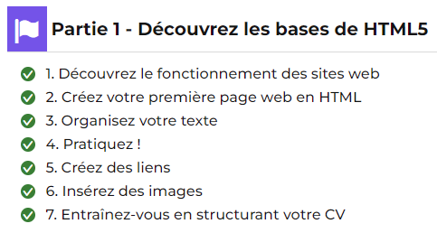

# Entraînez-vous en structurant votre CV

**À vous de jouer !** Pour vous entraîner, réalisez cet exercice étape par étape.

Une fois que vous avez terminé, vous pouvez comparer, auto-évaluer, votre
travail avec ma **Check-list**

## Contexte

Vous cherchez du travail et vous décidez de créer votre CV en ligne.
Pour cela, vous allez devoir créer votre première page HTML.

**Avant de commencer**, réaliser les 7 chapitres de la [Partie 1 - Découvrez les base de HTML5 ](https://openclassrooms.com/fr/courses/1603881-apprenez-a-creer-votre-site-web-avec-html5-et-css3)
, le 7e étant cet exercice 😀

## Votre mission

* Étape 1 : Créez une fichier `index.html`.
* Étape 2 : Découper le contenu de votre page avec un entête, un contenu principal et un pied de page.
* Étape 3 : Dans l'entête, ajoutez une photo miniature, sur laquelle on pourra cliquer pour avoir une version agrandie.
* Étape 4 : Toujours dans l'entête, créer un menu de navigation contenant des liens internes à la page, ancres,
  qui pointent vers les trois sections de votre CV (expérience, compétences, formation)
* Étape 5 : Dans le contenu principal, ajoutez votre nom et votre prénom dans un titre principal.
* Étape 6 : A la suite du titre principal, ajoutez trois sections avec un titre secondaire. 
  Ajouter une ancre, en mettant un id aux titres secondaires.
  * Mon expérience (vous pouvez en inventer 😅)
  * Mes compétences
  * Ma formation
  * _Chaque section contient un paragraphe ou une liste à puce._
* Étape 7 : Ajouter le copyright, l'année et votre adresse email dans le pied de page.

## Check-list

✅ La page HTML est un CV.

✅ On trouve votre nom et prénom dans l'onglet de la page.

✅ L'icône de la page s'affiche dans l'onglet.

✅ Le contenu de la page contient un entête `<header`> un contenu principal `<main>`
  est pied de page `<footer>`.

✅ Dans l'entête, une photo miniature cliquable renvoie sur la même photo agrandie.

✅ Le menu de navigation vous permet d'atteindre les trois sections de votre CV (expérience, compétences, formation).

✅ Le titre principal est un `<h1>` et contient votre nom et prénom.

✅ Trois sections en titre `<h2>` :
* mon expérience
* mes compétences
* ma formation

✅ Chaque section contient au minimum un paragraphe ou une liste à puce.

✅ Dans le pied de page on voit '©2022' suvi de votre adresse email.

✅ Votre email est un lien cliquable qui permet de vous écrire un email.

## Exemples de solutions
* https://divtec-cejef.github.io/101-SFA-HTML-CV-01/
* https://static.oc-static.com/activities/198/evaluation_resources/structurez-votre-cv_exemple-2019-01-03T081950.zip